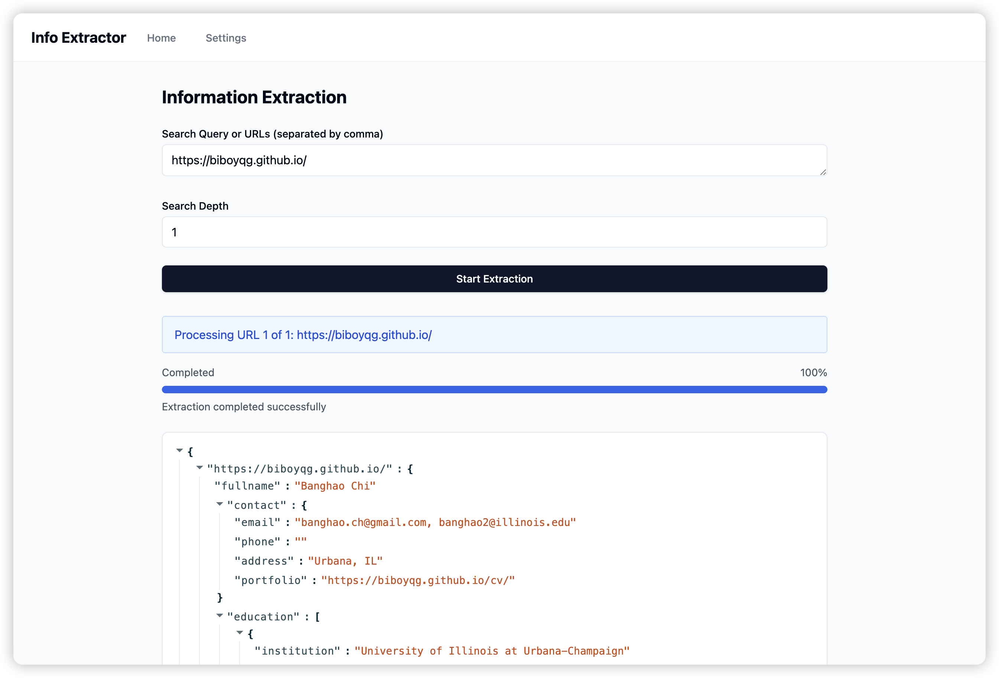

# Knowledge LLM Agent

## Overview

This repository presents a novel hierarchical framework for Language Model (LLM) assessment that mirrors human's information retrieval process. Our approach integrates Finite State Machines (FSM) to achieve structured outputs, enabling systematic assessment and improved database operations.

## Setup

> [!IMPORTANT]
>
> The requirement below is mandatory. And we've only tested our project on the following platform.

| Mandatory     | Recommended |
| ------------- | ----------- |
| Python        | 3.10        |
| CUDA          | 12.2        |
| torch         | 2.5.1       |
| transformers  | 4.45.1      |
| vLLM          | 0.6.6.post1 |
| DrissionPage  | 4.1.0.17    |
| DeepDiff      | 8.1.1       |
| FuzzyWuzzy    | 0.18.0      |

> [!TIP]
>
> Use `pip install -r requirement.txt` to install all the requirement if you want to create a new environment on your own or stick with existing environment.

### Quickstart

#### Repo Download

We first clone the whole project by git clone this repo:

```bash
git clone git@github.com:Forward-UIUC-2024F/banghao-chi-knowledge-agent.git && cd banghao-chi-knowledge-agent
```

#### Environment Setup

Then, it is necessary for us to setup a virtual environmrnt in order to run the project.

Currently, we don't provide docker image or dockerfile. So we recommend you to use `conda` to setup the environment.

> [!NOTE]
>
> You can rename `my_new_env` to any name you want.

```bash
conda env create -n my_new_env python=3.10 && conda activate my_new_env && pip install -r requirements.txt
```

You should also install docker desktop on your own machine, which is required for setting up the database. If you don't have it, you can download it from [here](https://www.docker.com/products/docker-desktop/).

Once you have the environment ready, you can setup the database by running:

```bash
docker compose up -d && make migrate-up
```

You can also setup the web interface by running the following code:
```bash
cd frontend && npm install --legacy-peer-deps
```

#### Launching Server

Then we need to setup server-side to provide the service to the clients. To launch our OpenAI-compatible server, simply:

> [!NOTE]
>
> Replcae `YOUR_MODEL_NAME` with the Huggingface directory of the model that you'd like to use

```bash
CUDA_VISIBLE_DEVICES=... NCCL_P2P_DISABLE=1 vllm serve YOUR_MODEL_NAME --gpu-memory-utilization=0.95 --trust-remote-code
```

#### Knowledge Extraction

##### Web Interface

After that, we can launch the provided fullstack application by running a simple bash script:
```bash
./dev.sh
```
By browsing `http:localhost:5173` and entering OpenAI base URL and model name, the only thing that you need to do to extract information is to provide the search query or URLs that you want the program to extract from, and then designate the number of max depth of gathering info:



##### CLI

We can also run our main program by inputting a search query, one URL or a list of URLs separated by comma:

> [!NOTE]
>
> Replcae `NUM_OF_DEPTH` with the desire number of depth that you want to extract for the object

```bach
python multi.py "Banghao Chi UIUC" -d NUM_OF_DEPTH
```

or:

```bach
python multi.py "https://illinois.edu/about/index.html" -d NUM_OF_DEPTH
```

or:

```bach
python multi.py "https://illinois.edu/about/index.html,https://www.gatech.edu/about" -d NUM_OF_DEPTH
```

## Codebase Structure

```
banghao-chi-knowledge-agent/
├── requirements.txt            # Project dependencies
├── .gitignore                  # Git ignore file
├── README.md                   # Project documentation
├── dataset/                    # Data storage and results
│   ├── article/                # Raw article data
│   ├── results/                # One-time FSM data
│   │   ├── gt/                 # Ground truth data
│   │   ├── open-source/        # Open-source model results
│   │   └── proprietary/        # Proprietary model results
│   └── source/                 # Source URLs
├── results/                    # Results of completed pipeline of knowledge extraction
│   ├── YOUR_MODEL_NAME/        # Final results with different depth of search
│   │   └── SCHEMA/             # Schema of the extracted entity
│   │       └── NUM_OF_DEPTH/   # Number of depth, which contains the final JSON file(s)
│   │           └── {name}.json # The extracted final JSON file(s)
│   ├── gt/                     # Groud truth data
│   │   └── SCHEMA/             # Schema of different groud truth data
│   │       └── {name}.json     # Groud truth JSON file(s)
│   ├── scrape/                 # Scraping results, which are used to compare with Firecrawl
│   └── fsm/                    # FSM integrated one-time results
├── schema/                     # Dynamically generated that are used to extract info 
│   ├── schema_manager.py       # Schema manager that can generate schemas
│   └── ...                     # Dynamically generated schemas
├── frontend/                   # Web interface(frontend)
├── api.py                      # Backend API
├── create_dataset.py           # Dataset creation utilities
├── eval.py                     # Evaluation metrics and scripts
├── generate_results.py         # Result generation for one-time FSM data
├── multi.py                    # Complete pipeline of intelligent knowledge extraction
├── database.py                 # Database operations
└── outlines.ipynb              # FSM explanation and example
```

## Functional Design (Usage)

This framework provides several key functionalities for extracting structured information from text using LLMs and FSM-guided outputs.

### Core Extraction Functions

* Extract structured information from text using open-source models (e.g. Qwen/Qwen2.5-72B-Instruct-AWQ):

```python
def get_response_from_open_source_with_extra_body():
    client = OpenAI()
    response = client.chat.completions.create(
        model=open_source_model_name,
        messages=[
            {
                "role": "system",
                "content": "...",
            },
            {
                "role": "user",
                "content": "...",
            },
        ],
        extra_body={"guided_json": your_pydantic_model.model_json_schema()},
    )
    return response.choices[0].message.content
```

### Evaluation Functions

* Compare extracted JSON against ground truth:

```python
def compare_json_objects(ground_truth: dict, test_object: dict):
  """
  Evaluates extraction accuracy against ground truth.
  Returns:
    OrderedDict with metrics:
      json_validity: bool
      key_similarity: float
      value_exactness: float
      numeric_similarity: float
      string_similarity: float
  """
```

## Demo Video

[Google Drive](https://drive.google.com/file/d/1NfJb7PlCTLgdWJNAMGxVCz5PRmFC1MY_/view?usp=sharing)

## Issues and Future Work

Explore more intelligent ways of:
- Scraping relevant links:
  - [ ] Utilize more of the search engine?
  - [ ] Utilize [browser-use-webui](https://github.com/warmshao/browser-use-webui) for browser control?
- Updating the JSON object:
  - [ ] Update field by field instead of the entire JSON object?
- [x] Dynamic schema creation
- [x] Bypass anti-scraping by rendering the page in the local browser
- [ ] Information effectiveness evaluation
- [ ] Database operations
- [ ] Modularize the codebase

## Contributors

* [Banghao Chi](https://biboyqg.github.io/)
* Advisor: [Kevin Chang](https://siebelschool.illinois.edu/about/people/faculty/kcchang)

## Change Log

Fall 2024 (Student 1)

* Week of 8/28/2024: Started the project and built interface demo.
* Week of 9/18/2024: Added the car schema, started to extract car data and evaluate the results.
* Week of 10/8/2024: Added the movie, professor schema, started to extract movie, professor data and evaluate the results.
* Week of 10/22/2024: Added explanation for the FSM and example.
* Week of 11/5/2024: Removed `Instructor-based` extraction and added pure `FSM-based` extraction.
* Week of 11/20/2024: Added the database setup, connection, and migration.
* Week of 12/11/2024: Implemented multi-phase knowledge extraction and database operations.
* Week of 12/20/2024: Finalized first version of the project.
* Week of 1/10/2024: Completed intelligent recursive scraping with max depth, brave search
API integration and comprehensive logging system.
* Week of 1/21/2024: Implemented schema manager, including schema detection and dynamic schema creation and finishing the enhanced version of pipeline of LLM-based Knowledge Agents.

## License

[License information will be added]

## Acknowledgments

Special thanks to [Kevin Chang](https://siebelschool.illinois.edu/about/people/faculty/kcchang) and National Center for Supercomputing Applications([NCSA](https://ncsa.illinois.edu/)) for providing the research infrastructure and support for this project.
